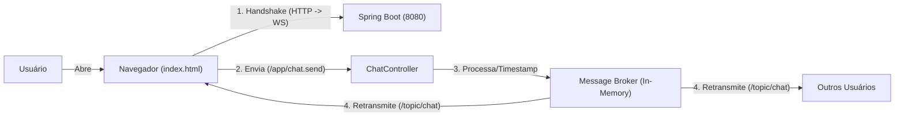

# Spring Boot + WebSocket + STOMP (Chat Simples)

> [!NOTE]
> > Este é um projeto didático focado na implementação de **Comunicação em Tempo Real** utilizando WebSockets.
> > A motivação do projeto veio de alguns semestres atrás quando realizei uma atividade semelhante numa aula de redes, onde foi criado um bate-papo em C, com isso quis brincar um pouco com o Spring realizando a mesma tarefa.
> > O projeto tem como foco no protocolo **STOMP** e na lógica de Pub/Sub (Publicação e Assinatura) do Spring.

---

## Arquitetura do Projeto

O projeto funciona com um modelo de *Message Broker* em memória para rotear mensagens entre usuários conectados em salas específicas.


## Componentes do Projeto

- **WebSocketConfig**  
  Configura o endpoint `/ws`, onde a conexão WebSocket é iniciada via **SockJS**, e habilita o **Message Broker** para os tópicos (`/topic`).

- **ChatController**  
  Atua como o *porteiro* da aplicação. Recebe mensagens enviadas para destinos com prefixo `/app`, processa os dados (ex: adiciona timestamp) e publica a mensagem no tópico público correspondente.

- **ChatMessage**  
  Modelo de dados (DTO) que representa uma mensagem do chat, contendo:
  - remetente
  - conteúdo
  - horário

- **index.html**  
  Cliente frontend puro. Utiliza **SockJS** para compatibilidade entre navegadores e **Stomp.js** para gerenciar o envio e recebimento de mensagens no formato JSON.

---

## 🛠 Tecnologias Utilizadas

- Java 21 + Spring Boot 3
- Spring WebSocket (base da comunicação)
- STOMP (protocolo de mensagens baseado em texto)
- SockJS Client (biblioteca JavaScript para fallback de conexão)
- Bootstrap 5 (estilização da interface)

---

## ▶️ Execução

### Backend (Spring Boot)

Certifique-se de que o Java está instalado e execute:

```bash
./mvnw spring-boot:run
# O servidor iniciará na porta 8080
```

### Cliente
Como o frontend é um arquivo estático simples, você pode simplesmente abrir o arquivo index.html diretamente no seu navegador.
Nota: O CORS já está configurado no backend (setAllowedOriginPatterns("*")) para aceitar conexões externas.

Como Testar:
Abra o navegador em http://localhost:8080 (ou abra o arquivo HTML).
Preencha o Nome (ex: "Alice") e a Sala (ex: "geral").
Clique no botão Conectar. A caixa de chat aparecerá.
Abra uma Janela Anônima ou outro navegador.
Repita o processo com outro nome (ex: "Bob") mas na mesma sala ("geral").
Envie mensagens e observe a atualização instantânea nas duas telas.

Conceitos:
WebSocket vs HTTP: Demonstração prática de como o servidor pode enviar dados ativamente ("push") para o cliente sem que o cliente precise solicitar (polling).
Roteamento Dinâmico: O uso de @DestinationVariable no Spring permite criar salas de chat dinâmicas (/topic/chat/{room}) sem configuração prévia.


